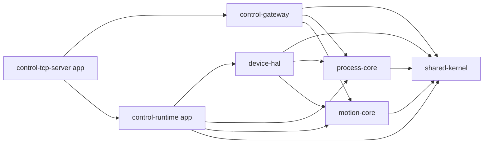

# 跨仓拆分基线（SiligenSuite）

## 目标

这份基线文档用于回答两个问题：

1. 当前仓内模块化完成后，后续若拆到 `D:\Projects\SiligenSuite`，各模块应该如何落位
2. 哪些依赖关系已经足够稳定，可以作为跨仓拆分的第一版边界

当前建议把本仓库视为“单仓过渡态”，而不是最终形态。

## 当前稳定边界

已经具备独立边界雏形的模块：

- `modules/shared-kernel`
- `modules/process-core`
- `modules/motion-core`
- `modules/device-hal`
- `modules/control-gateway`
- `apps/control-runtime`
- `apps/control-tcp-server`

其中最稳定、最适合优先外提的是：

1. `process-core`
2. `motion-core`
3. `device-hal`
4. `control-gateway`

`shared-kernel` 已经具备抽离条件，但由于它是所有模块的底层依赖，建议在第一轮跨仓拆分时谨慎处理；若团队希望先降低迁移风险，可先保持它留在集成仓或以 subtree/submodule 方式共享。

## 依赖总图



说明：

- `shared-kernel` 只向上提供基础能力，不反向依赖任何业务模块
- `process-core` 与 `motion-core` 应保持并列，不互相吞并
- `device-hal` 是硬件与运行时适配层，依赖 core，但不承载 core 规则定义
- `control-gateway` 只承载协议适配与外部输入输出，不内嵌领域规则
- `control-runtime` 是装配层，不应反向沉淀成新的大杂烩核心

## 建议目录落位

建议未来在 `D:\Projects\SiligenSuite` 下形成如下布局：

```text
D:\Projects\SiligenSuite\
├─ shared-kernel\
├─ process-core\
├─ motion-core\
├─ device-hal\
├─ control-gateway\
├─ control-apps\
│  ├─ control-runtime\
│  └─ control-tcp-server\
└─ control-core\
   └─ (过渡期集成仓 / 迁移编排 / 联调缓冲区)
```

如果你希望更保守，可以采用“4+1”落位：

- 第一轮只外提：
  - `process-core`
  - `motion-core`
  - `device-hal`
  - `control-gateway`
- `shared-kernel` 暂留集成仓
- apps 仍留在当前 `control-core`

这种做法的优点是：

- 减少基础依赖一次性重排风险
- 先把主要业务边界拆开
- 把跨仓构建复杂度延后到第二轮处理

## 每个模块的未来仓职责

### `shared-kernel`

建议只保留：

- `Result<T>` / `VoidResult`
- 错误模型
- 小型基础类型
- 稳定字符串/时间/基础工具

禁止进入：

- 配方
- 运动命令
- TCP DTO
- 厂商 SDK 类型

### `process-core`

建议承载：

- 配方
- 配方版本
- 参数 schema
- 工艺校验
- 工艺激活
- 点胶执行编排语义

避免承载：

- 实际控制卡调用
- TCP 协议对象
- 运行时线程调度细节

### `motion-core`

建议承载：

- 运动语义
- 互锁/限位/安全规则
- jog / homing / move 等控制语义
- 轨迹与插补领域语义

避免承载：

- SDK 调用
- 设备连接生命周期
- 网络协议

### `device-hal`

建议承载：

- MultiCard 及其他设备适配器
- 厂商错误码映射
- IO / 阀 / 供胶 / 诊断 / 运行时资源适配

避免承载：

- 工艺规则
- 运动规则定义
- TCP 命令解释与响应映射

### `control-gateway`

建议承载：

- JSON 协议
- TCP command dispatch
- Facade / DTO / response mapping

避免承载：

- 长流程业务编排
- 设备状态轮询
- 工艺与运动核心规则

### `control-apps`

建议承载：

- `control-runtime`
- `control-tcp-server`
- 最终可执行入口
- 配置装配
- 依赖编排

避免承载：

- 通用领域规则沉淀
- 跨 app 共享的业务核心

## 推荐拆分顺序

### 顺序 A：保守型

1. 先外提 `process-core`
2. 再外提 `motion-core`
3. 再外提 `device-hal`
4. 再外提 `control-gateway`
5. 最后处理 `shared-kernel` 与 `control-apps`

适用场景：

- 当前仍以单仓构建为主
- 团队想先验证边界，而不是先解决包管理/版本管理

### 顺序 B：边界优先型

1. 先外提 `shared-kernel`
2. 再平行外提 `process-core` / `motion-core`
3. 再处理 `device-hal`
4. 再处理 `control-gateway`
5. 最后单独组装 `control-apps`

适用场景：

- 团队已经准备好做跨仓 CMake/包管理
- 希望尽快形成可复用依赖底座

## 当前建议

结合你目前的仓库状态，更建议采用“保守型”：

- 当前已经在仓内证明了边界可行
- 但跨仓之后还要处理 include、target、版本、联调和 CI
- 因此第一轮最好先拆最有价值的 4 个模块，把 `shared-kernel` 和 apps 放到第二轮

一句话结论：

先把“业务核”和“适配层”拆清，再处理“公共底座”和“最终装配”，整体风险最低。
