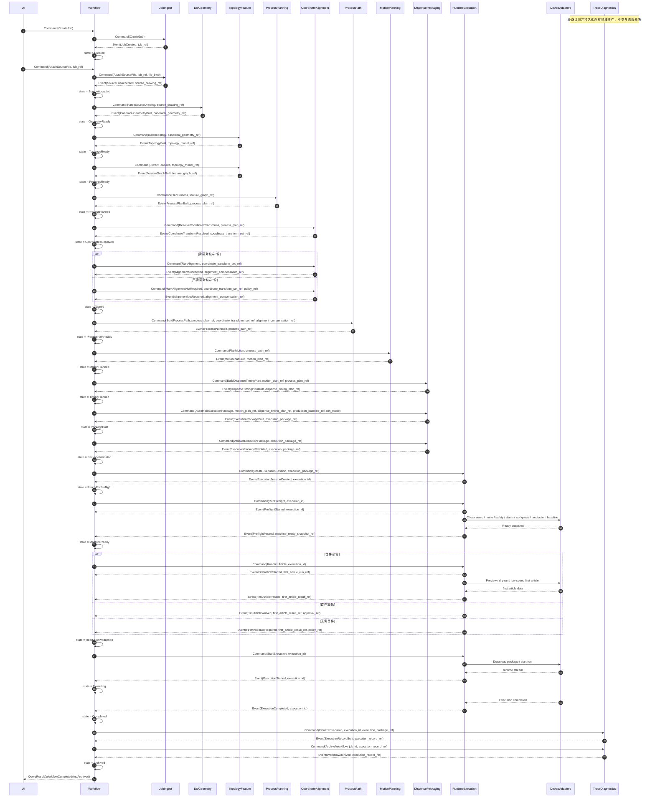
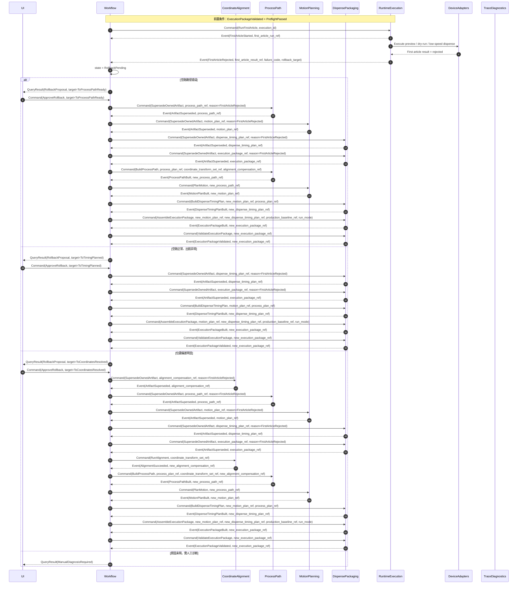
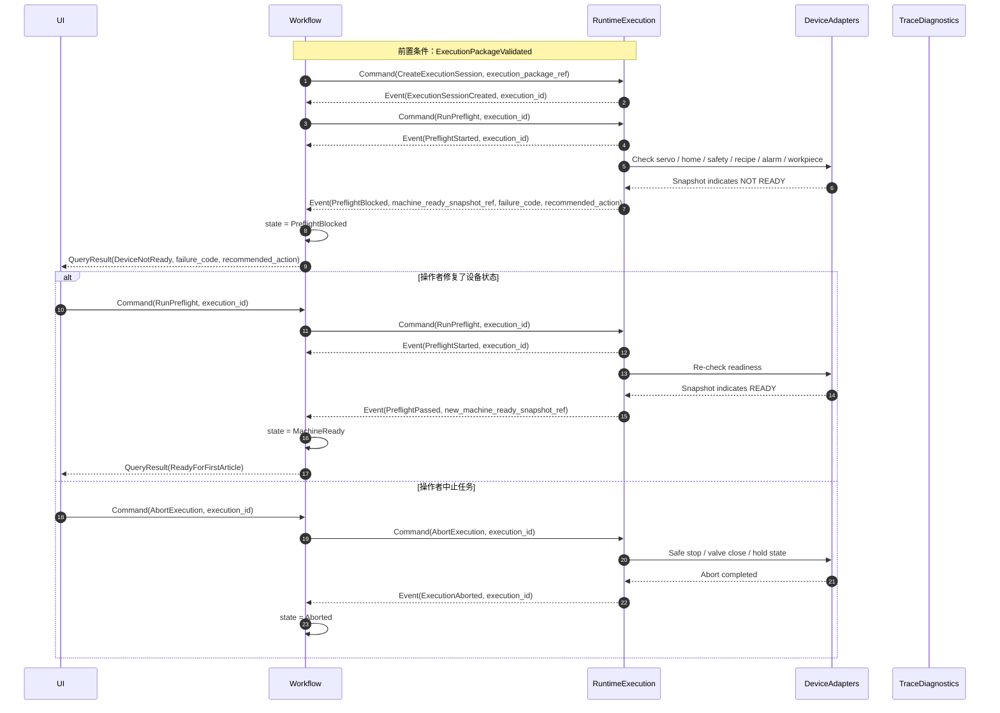
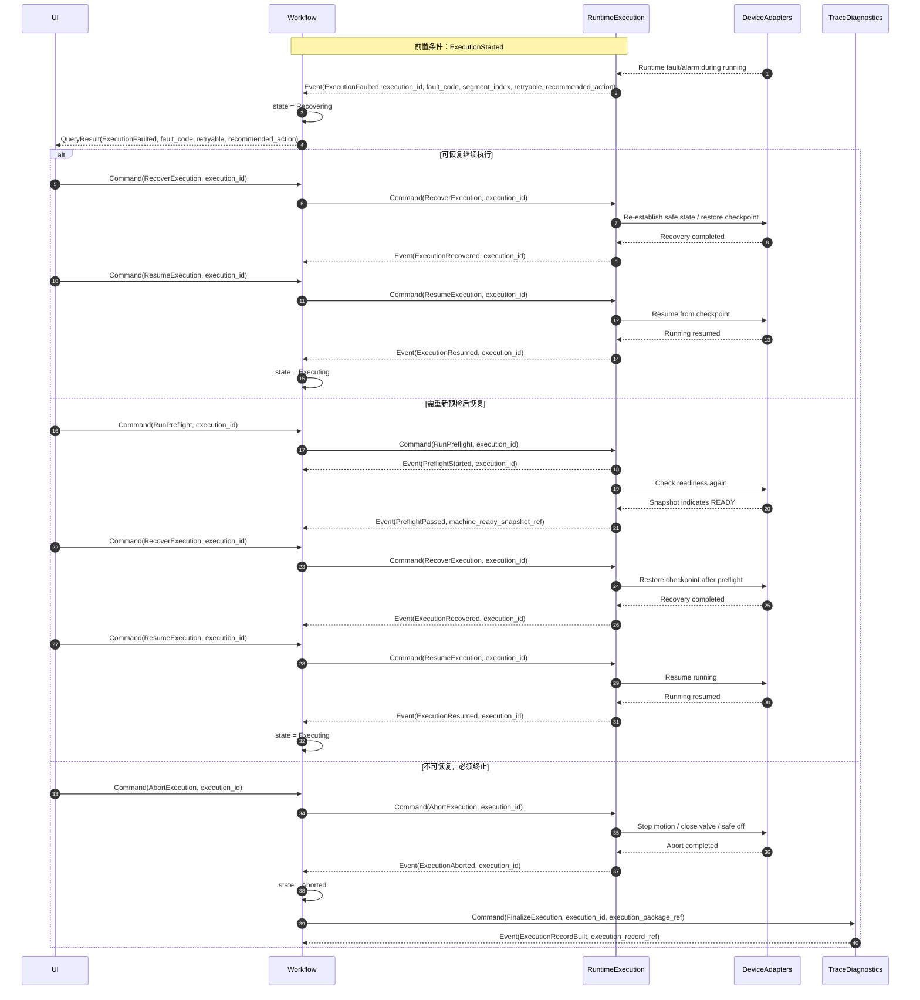
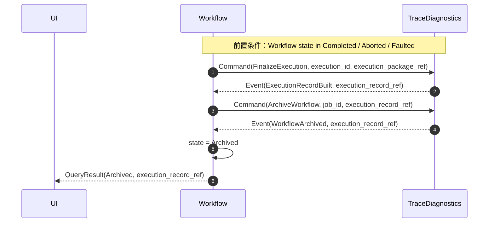

# 《点胶机端到端流程规格说明 s08：系统时序图模板（修订版）》

Status: Frozen
Authority: Primary Spec Axis S08
Applies To: end-to-end system sequence templates
Owns / Covers: success, block, rollback, recovery, archive sequence templates and actor interactions
Must Not Override: S01 stage chain; S03 rollback policy; S05 module owner; S07 state and command definitions
Read When: wiring end-to-end interactions, command/event order, artifact generation points, trace side effects
Conflict Priority: use S08 for sequence ordering; defer state legality to S07 and owner boundary to S05
Codex Keywords: sequence template, success chain, rollback chain, recovery chain, archive chain, trace side effect

---

## Codex Decision Summary

- 本文裁决主成功链、首件回退链、设备阻断链、恢复链与归档链的系统时序表达。
- 本文不裁决状态枚举或 owner 分配；状态与命令以 S07 为准，owner 以 S05 为准。
- 命令与事件必须区分；产物生成点必须显式出现；Trace 是旁路固化，不是控制中心。

---
本版目标是把前面已经冻结的以下内容真正串成可实现的系统时序模板：

- 阶段链
- 对象链
- 模块链
- 状态机
- 命令 / 事件模型
- 回退与归档闭环

本版覆盖 5 条关键链路：

1. 主成功链
2. 首件失败回退链
3. 设备未就绪阻断链
4. 运行时故障恢复 / 终止链
5. 执行固化与归档链

相较旧版，本版重点修正：

- 显式区分 `ExecutionPackageBuilt` 与 `ExecutionPackageValidated`
- 把 `AlignmentNotRequired` 纳入正式时序
- 明确 `PreflightBlocked` 的退出路径
- 在回退链中显式加入 `ArtifactSuperseded`
- 明确 `WorkflowArchived` 由归档 owner 产出
- 不再用粗粒度 `FirstArticleCompleted` 代替首件四分流

---

# 1. 参与者约定

| 缩写 | 模块 | 说明 |
|---|---|---|
| UI | HMI / 应用服务 | 用户交互入口 |
| WF | 工作流编排模块 | 顶层状态机与命令编排 |
| JI | 任务与文件接入模块 | `JobDefinition`、`SourceDrawing` |
| DG | DXF/规范几何模块 | `CanonicalGeometry` |
| TF | 拓扑与制造特征模块 | `TopologyModel`、`FeatureGraph` |
| PP | 工艺规划模块 | `ProcessPlan` |
| CA | 坐标/对位/补偿模块 | `CoordinateTransformSet`、`AlignmentCompensation` |
| PH | 工艺路径模块 | `ProcessPath` |
| MP | 运动规划模块 | `MotionPlan` |
| PK | 点胶时序与执行包模块 | `DispenseTimingPlan`、`ExecutionPackage` |
| RT | 设备运行时模块 | 预检、首件、正式执行 |
| TR | 追溯与诊断模块 | `ExecutionRecord`、`TraceLinkSet`、日志固化 |
| DEV | 设备适配层 | 控制卡 / PLC / IO / 点胶控制器 |

---

# 2. 时序图使用规则

## 2.1 命令与事件必须区分
建议约定：
- `Command(...)`：请求动作
- `Event(...)`：已发生事实

例如：
- `Command(PlanMotion)`
- `Event(MotionPlanBuilt)`

## 2.2 产物生成点必须显式出现
不要只写“调用某模块”，必须明确产出了什么对象。

例如：
- `DG -->> WF: Event(CanonicalGeometryBuilt, geometry_ref)`
- `MP -->> WF: Event(MotionPlanBuilt, motion_plan_ref)`

## 2.3 所有关键事件都应带引用
至少包含：
- `job_id`
- `workflow_id`
- `artifact_ref`
- `request_id`
- `correlation_id`
- `causation_id`

运行时事件还应带：
- `execution_id`
- `execution_package_ref`
- `segment_index`

## 2.4 失败链必须停在明确阻断态或终止态
例如：
- 设备未 ready -> `PreflightBlocked`
- 首件失败 -> `RollbackPending`
- 运行时不可恢复 fault -> `Faulted / Aborted`

## 2.5 回退不是回调函数，而是显式决策链
应包含：
- 失败事件
- 回退请求
- 审批或自动判定
- `ArtifactSuperseded`
- 回退执行
- 新版本重建

## 2.6 Trace 是旁路固化，不是控制中心
`TR` 负责记事实，不负责替代 `WF` 做流程决策。

---

# 3. 主成功链时序图

这是“从上传 DXF 到执行完成并归档”的标准成功路径。

## 3.1 Mermaid 模板

## 3.2 主成功链说明

这条链有 7 个关键控制点：

### A. `SourceFileAccepted`
文件接收成功，不等于几何可用。

### B. `CoordinateTransformResolved`
从这一点开始，设计世界与设备世界建立了静态映射。

### C. `AlignmentSucceeded / AlignmentNotRequired`
无对位任务必须走 `AlignmentNotRequired`，不允许“跳过对象”。

### D. `ExecutionPackageBuilt`
表示冻结包已组装，不代表已经可执行。

### E. `ExecutionPackageValidated`
表示离线规则通过，是进入设备门禁层前最后一个纯离线事实点。

### F. `PreflightPassed`
表示当前设备条件可执行。

### G. `WorkflowArchived`
表示追溯与归档链已闭环，不等于仅仅执行完成。

---

# 4. 首件失败回退链时序图

这条链服务于最常见、也最有工程价值的一类异常：  
**离线规划看起来没问题，但首件不通过。**

重点不是“失败了”，而是失败后回到哪一层，以及旧对象如何被显式失效。

## 4.1 Mermaid 模板

## 4.2 首件失败链说明

这条链最重要的不是“首件失败”本身，而是三分流：

### 分流 1：空跑就错
优先回退到：
- `ToProcessPathReady`
- 必要时 `ToMotionPlanned`

说明问题主要在：
- 路径顺序
- 几何连接
- 轨迹可执行性

### 分流 2：空跑对，出胶错
优先回退到：
- `ToTimingPlanned`
- 必要时 `ToProcessPlanned`

说明问题主要在：
- 阀时序
- 起停补偿
- 工艺参数

### 分流 3：位置偏
优先回退到：
- `ToCoordinatesResolved`

说明问题主要在：
- 对位补偿
- 基准映射
- 工件/治具坐标

## 4.3 实现红线
必须写成硬规则：

1. `FirstArticleRejected` 后，不允许直接 `StartExecution`
2. 回退目标必须是正式枚举，不能是任意字符串
3. 批准回退后，旧下游产物必须先 `ArtifactSuperseded`
4. 若失败原因未明，不允许自动乱回退，必须人工诊断

---

# 5. 设备未就绪阻断链时序图

这条链的目标，是把“设备暂时不能跑”和“规划错误”彻底拆开。

## 5.1 Mermaid 模板

## 5.2 设备未就绪链说明

这条链最关键的结论只有一条：

`PreflightBlocked` 是门禁阻断，不是规划失败。

因此发生以下问题时：
- 未回零
- 伺服未 ready
- 工件未到位
- 安全门未闭合
- `production_baseline 未解析或不一致`
- 活动报警
- 气压/温度未达标

系统应该：
- 保留 `ExecutionPackageValidated`
- 保留所有上游规划对象
- 停在 `PreflightBlocked`
- 修复设备条件后允许重试预检

而不应：
- 重算路径
- 重算轨迹
- 改写工艺参数
- 让旧包悄悄失效

---

# 6. 运行时故障恢复 / 终止链时序图

这条链服务于正式执行中的典型异常。重点不是只报一个 `fault`，而是分成：

- 可恢复继续执行
- 需重新预检后恢复
- 必须终止

## 6.1 Mermaid 模板

## 6.2 运行时故障分层建议

| 故障类 | 典型例子 | 推荐处理 |
|---|---|---|
| 运动类 | 跟随误差、超限、回零丢失 | 重新预检或终止 |
| 工艺类 | 堵针、无胶、压力异常 | 视处理结果恢复或终止 |
| 对位类 | 视觉丢失、补偿失效 | 通常终止或回到补偿层新版本链 |
| 安全类 | 急停、门开、安全链断开 | 立即终止，不自动恢复 |

## 6.3 恢复链的关键实现规则

### 规则 A：恢复前必须有稳定检查点
恢复必须依赖显式记录的：
- `segment_index`
- `motion_checkpoint`
- `valve_state`
- `execution_package_ref`

### 规则 B：不是所有 fault 都允许 `ResumeExecution`
例如：
- 安全链触发
- 段索引错乱
- 执行包一致性失配

这类故障原则上不应直接 `resume`。

### 规则 C：恢复不等于回退重规划
运行时故障先看能否恢复执行条件；只有复盘证明确属上游规划问题，才进入新回退链。

---

# 7. 执行固化与归档链时序图

这条链把 “执行结束” 与 “追溯归档完成” 分开建模。

## 7.1 Mermaid 模板

## 7.2 归档链说明

### A. `ExecutionRecordBuilt`
表示执行事实已固化：
- 最终状态
- 首件结论
- fault 历史
- 关键快照
- 对象引用链

### B. `WorkflowArchived`
表示追溯链正式进入归档态：
- 可查询
- 可复盘
- 不再作为活动工作流继续执行

### C. 两者不能混为一谈
- `ExecutionRecordBuilt` 不代表已归档
- `WorkflowArchived` 不可由编排层自己假定成功

---

# 8. 四类异常链与状态机的对应关系

| 链路 | 主要状态机 | 关键阻断态 / 终止态 |
|---|---|---|
| 主成功链 | 顶层任务状态机 + 执行状态机 | `Completed -> Archived` |
| 首件失败回退链 | 首件状态机 + 回退状态机 | `RollbackPending` |
| 设备未就绪阻断链 | 执行状态机 | `PreflightBlocked` |
| 运行时故障链 | 执行状态机 | `Recovering / Aborted / Faulted` |
| 归档链 | 顶层任务状态机 + 追溯链 | `Archived` |

---

# 9. 系统实现时建议固化的检查点

## 9.1 规划检查点
每生成一个核心产物就固化一次：
- `canonical_geometry_ref`
- `feature_graph_ref`
- `process_plan_ref`
- `motion_plan_ref`
- `execution_package_ref`

## 9.2 执行检查点
至少在以下时刻固化：
- `ExecutionPackageValidated`
- `PreflightPassed`
- `FirstArticleStarted`
- `FirstArticlePassed / Rejected / Waived / NotRequired`
- `ExecutionStarted`
- `ExecutionPaused`
- `ExecutionRecovered`
- `ExecutionCompleted / Aborted / Faulted`

## 9.3 运行中检查点
至少周期性记录：
- `segment_index`
- `feature_id`
- `valve_state`
- `axis_group_state`
- 最近一次 `fault_code`

---

# 10. HMI 展示层最小状态面板建议

基于这 5 条时序链，HMI 至少应同时展示 5 个维度：

## 10.1 顶层任务状态
例如：
- `MotionPlanned`
- `PackageValidated`
- `MachineReady`
- `Executing`
- `Archived`

## 10.2 首件状态
例如：
- `Pending`
- `DryRunRunning`
- `AwaitingInspection`
- `Rejected`
- `Waived`
- `NotRequired`
- `Passed`

## 10.3 执行状态
例如：
- `PreflightBlocked`
- `Running`
- `Paused`
- `Recovering`
- `Faulted`
- `Aborted`

## 10.4 最近一次建议动作
例如：
- `RetryPreflight`
- `ReAlign`
- `RollbackToTimingPlanned`
- `AbortExecution`

## 10.5 当前活动对象版本
至少展示：
- `process_plan_ref`
- `motion_plan_ref`
- `dispense_timing_plan_ref`
- `execution_package_ref`

不要让 UI 从日志字符串里自己猜这些状态。

---

# 11. 这一版最关键的工程结论

## 11.1 真正高价值的不是“把成功链画出来”
而是把 4 类异常链清楚分开：
- 首件失败
- 设备未就绪
- 运行时故障
- 归档失败/未归档

## 11.2 回退链和恢复链不是一回事
- 回退链：通常回到规划层或首件前层，伴随 `ArtifactSuperseded`
- 恢复链：通常在执行层内恢复运行条件，不自动改规划

## 11.3 `PreflightBlocked` 和 `Faulted` 必须分开
一个是“现在不能跑”，一个是“这次执行失败了”。

## 11.4 `WorkflowArchived` 是正式系统事实
它不是“写完一条追溯记录”的副作用，而是需要显式命令与显式事件确认的收尾阶段。

## 11.5 这 5 条时序链已经足够指导第一版编排实现
你现在已经有了：
- 模块划分
- 对象边界
- 状态机
- 命令/事件
- 关键时序
- 回退与归档闭环

这已经足够开始搭系统骨架并推进联调。
