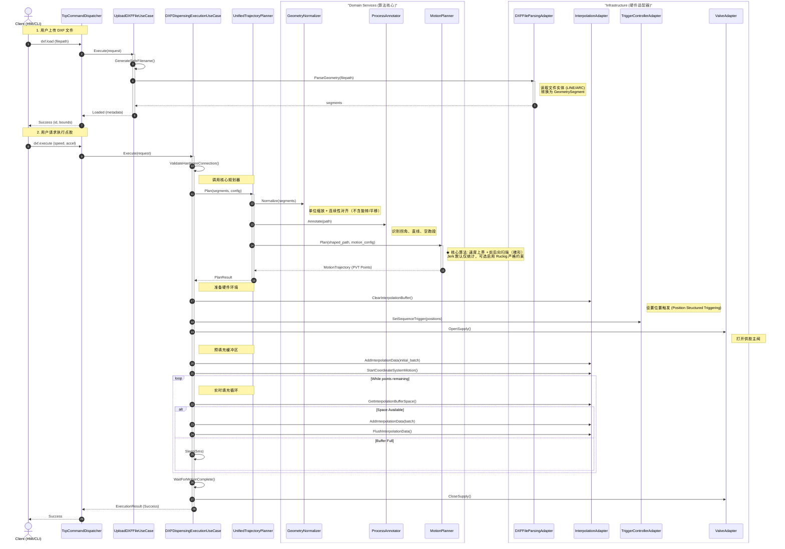
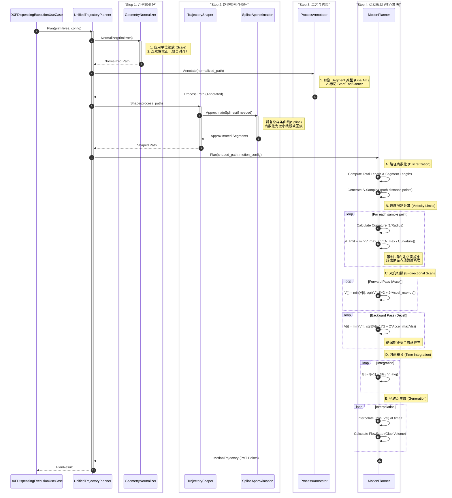

# DXF 点胶流程全链路分析报告

**日期**: 2026-02-01  
**范围**: DXF 文件加载、解析、轨迹规划至点胶执行的端到端流程  
**代码库版本状态**: 基于 `src/application/usecases/dispensing/dxf` 及相关 Adapter 实现

本文档整合了对 DXF 点胶业务流程的代码静态分析，包含两份时序图：
1.  **全流程概览**：从 TCP 入口到硬件执行的宏观视图。
2.  **规划阶段详解**：`UnifiedTrajectoryPlanner` 内部几何处理与速度规划（前后向扫描）的微观视图。

---

## 1. 全流程概览 (Loading -> Execution)

本阶段展示系统如何响应 `dxf.load` 和 `dxf.execute` 指令，并协调 UseCase、Parser 和 Driver 完成任务。

### 时序图

### 关键说明
1.  **加载与规划分离**：DXF 解析在加载阶段完成（`ParseGeometry`），而轨迹规划在执行阶段触发。这允许用户调整速度参数而无需重新解析文件。
2.  **缓冲流控**：执行阶段采用“生产者-消费者”模式，`UC_Exec` 负责监控硬件缓冲区状态并动态填充数据。
3.  **位置触发**：点胶阀的开关不是由软件实时控制，而是预先下发位置序列（`SetSequenceTrigger`），由硬件在运动到位时自动触发。

---

## 2. 规划阶段详解 (UnifiedTrajectoryPlanner)

本阶段深入 `UnifiedTrajectoryPlanner` 内部，展示原始几何段如何转化为包含时间戳的运动轨迹。

### 时序图

### 算法细节解析

1.  **ProcessAnnotator (工艺标注)**
    *   **输入**: 几何路径 (GeometrySegment列表)。
    *   **输出**: 带标签的路径 (ProcessPath)。
    *   **核心逻辑**: 识别轨迹中的关键特征。例如，将非点胶的连接移动标记为 `Rapid` (空跑)，将两段线夹角较小的连接点标记为 `Corner` (拐角)。这些标签直接影响后续的速度规划策略（例如 Corner 处强制减速）。

2.  **SplineApproximation (样条拟合)**
    *   **目的**: 将 DXF 中的 NURBS 样条曲线转换为机器控制器能理解的简单几何图元（通常是微直线段或圆弧）。
    *   **实现**: 使用误差步长与自适应步长进行离散化；无递归分割。

3.  **MotionPlanner (运动规划)**
    *   **策略**: 采用“路径-速度解耦”法。先规划几何路径，再在路径上规划速度分布。
    *   **速度曲线**: 以速度上界为基础，通过双向扫描进行加速度可达性裁剪（梯形规划）。若外部提供 S-Curve 剖面，也会被裁剪以满足路径约束。
    *   **Jerk 约束**: 默认仅统计，不参与速度规划；可选启用 Ruckig 严格约束（`enforce_jerk_limit`）。
    *   **约束条件**:
        *   **最大速度 (V_max)**: 机器物理限制或工艺限制。
        *   **向心加速度 (A_cent)**: `V^2 / R <= A_max`，限制过弯速度。
        *   **最大加速度 (A_max)**: 电机扭矩限制。

---
**Note**: 本文档由 Gemini CLI 自动生成，基于 `src` 目录下的源代码分析。
